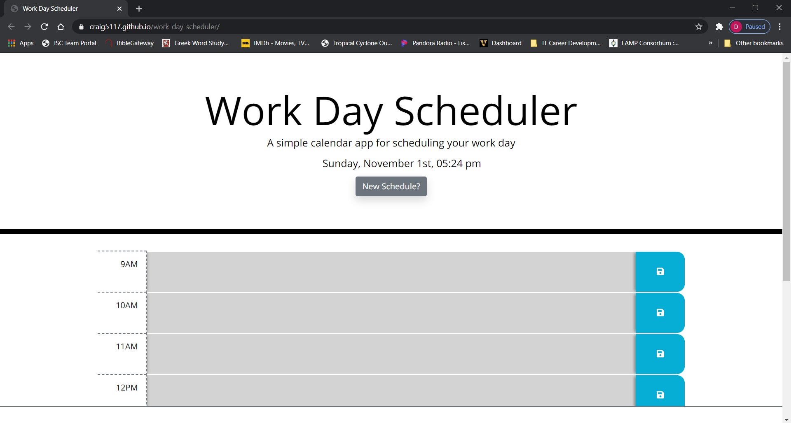
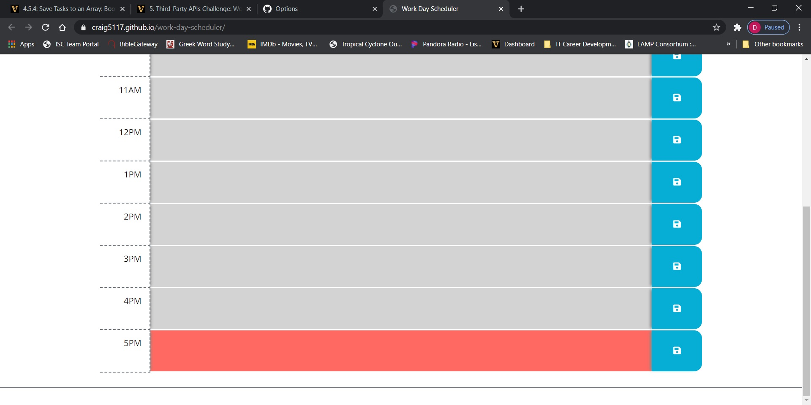

# Work Day Scheduler

## Purpose
A simple calendar application for scheduling your work day.
### Table of Contents
- [Built With](#built-with)
- [Contribution](#contribution)
    - [Author Contact Info](#author-contact-info)
- [Features](#features)

## Built With
- HTML
- CSS
- Javascript
- [JQuery](https://jquery.com/) (https://code.jquery.com/jquery-3.4.1.min.js)
- [Bootstrap](https://getbootstrap.com/) (https://stackpath.bootstrapcdn.com/bootstrap/4.3.1/css/bootstrap.min.css)
- [Font Awesome](https://fontawesome.com/) (https://use.fontawesome.com/releases/v5.8.1/css/all.css)
- [Moment.js](https://momentjs.com/) (https://cdnjs.cloudflare.com/ajax/libs/moment.js/2.24.0/moment.min.js)

[Back to Contents](#table-of-contents)

---

## Website
https://craig5117.github.io/work-day-scheduler/

[Back to Contents](#table-of-contents)

---
## Features
- Displays current time for user convenience. The time is updated every 15 minutes.
- Future events are highlighted in green, current hour is highlighted in red, past events are gray.
- The user may enter an event into the provided text area and click the save button to save their event.
- If the user does not click save but continues down the list filling in time slots, the app will automatically save their entries.
- When the user wants to start an entirely new schedule, they can simply click the new schedule button for a clean slate.
- Layout is slightly modified for mobile screens.

---

## Contribution

**Craig Bennett**

### Author Contact Info:

GitHub: https://github.com/Craig5117

LinkedIn: https://www.linkedin.com/in/craig-bennett-852a571b4/

[Back to Contents](#table-of-contents)

